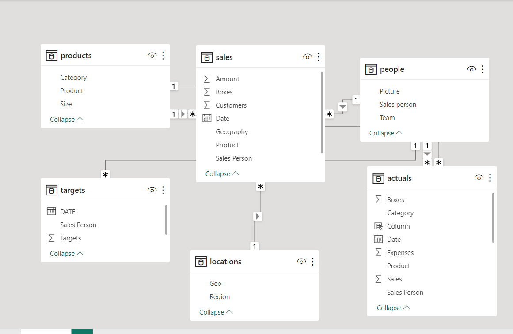

# Sales-Performance-Report-with-Power-bi

### OVERVIEW

This is a power bi project to Analyse the sales data of an imaginary Company called Awesome Chocolate, to discover hidden insights within their data for a more informed decision making.

### DATA SOURCE

Data was gotten online for practice puporses 

_Disclaimer: All datasets and report do not in any way represent any institution, This is just a dummy dataset to showcase my ability to use Power Bi_

### SKILLS SHOWN

- DATA CLEANING
- USE OF DAX
- VISUALIZATION
- POWER BI
  
### STEPS TAKEN 

- DATA IMPORTATION - I used the csv data source to import the data into power bi.
- DATA INSPECTION
- DATA CLEANING - I proceeded to power bi to go through my data one more time to be sure its ready to be worked with.
- MEASURE CREATION - I used dax to create a new column named age band
  1. Created a Measure Total Sales, Total Target, Total Boxes sold and Total Expenses
  2. Used a measure to find the Total Profit by subtracting the the total expenses from the total sales.
  3. Created a measure for the Variance by using subtrating total sales by total target.
  4. Created a measure for the Price Per Box by using the DIVIDE function to divide the Profit by total Boxes Then went ahead to divide the Variance by Total Target to get the Variance %.
- VISUALISATION -Visualized the data and put the dashboard together.

## MODELLING

## VISUALIZATION

## CONCLUSION

THANK YOU. 🙂 💘
